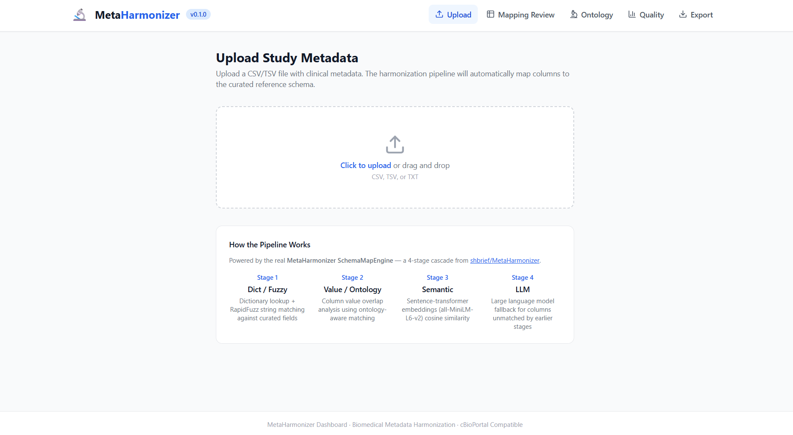
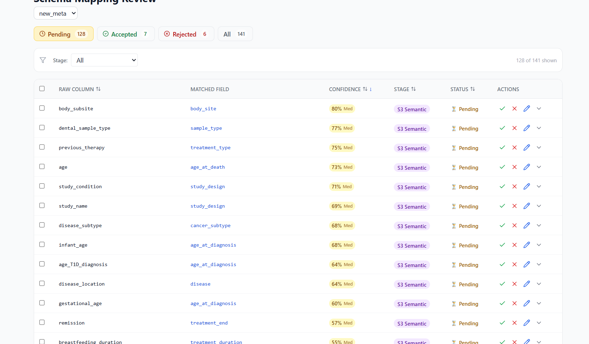
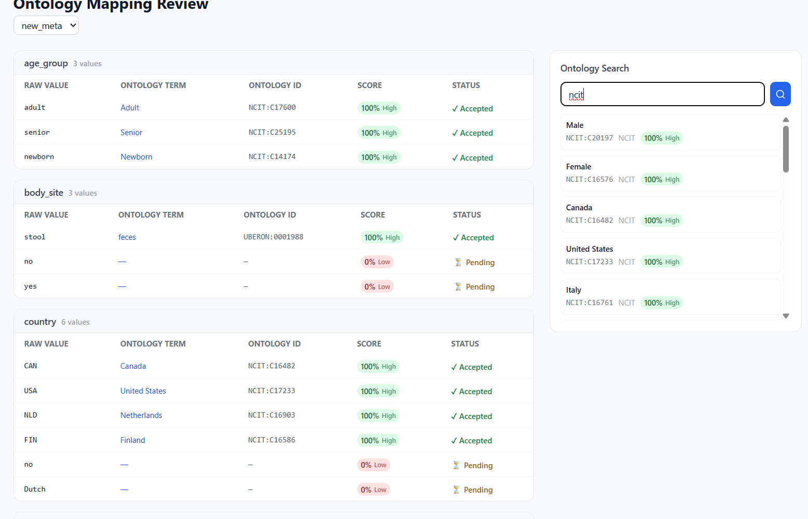
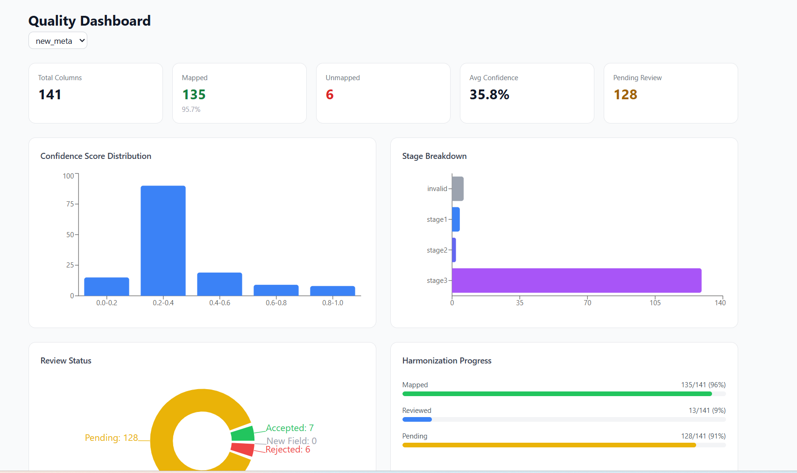
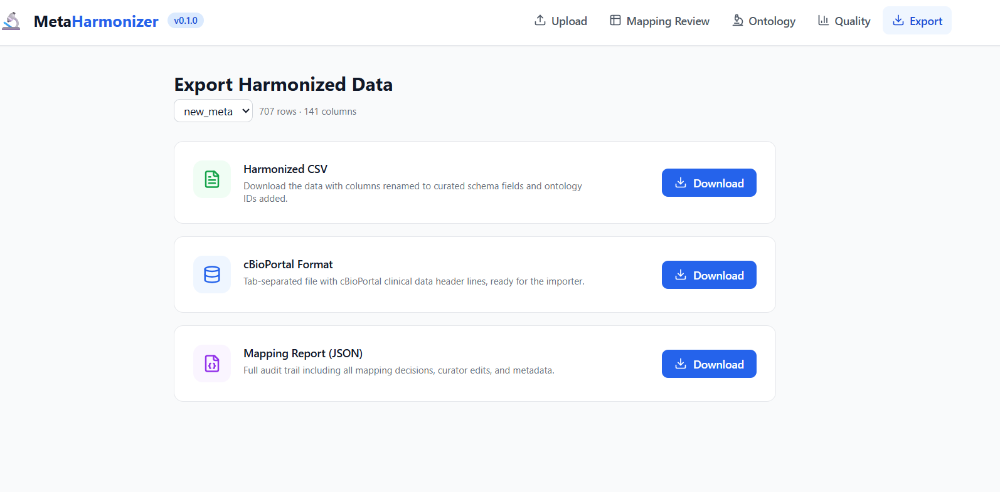

# 🔬 MetaHarmonizer

**Automated biomedical metadata harmonization platform for cBioPortal-compatible clinical datasets.**

MetaHarmonizer bridges the gap between raw, inconsistent clinical metadata and standardized, ontology-annotated schemas. It combines a multi-stage ML pipeline with an interactive curator review dashboard, enabling researchers to harmonize metadata at scale while maintaining expert oversight.

> **Demo submission** for [GSoC 2026 — Automated Clinical Metadata Harmonization Dashboard](https://github.com/cBioPortal/GSoC/issues/136)

---

## The Problem

cBioPortal hosts 400+ cancer genomics studies with clinical metadata from diverse sources. Cross-study metadata heterogeneity severely limits analysis:

| Issue | Examples |
|-------|----------|
| **Attribute naming** | `AGE`, `AGE_AT_DIAGNOSIS`, `DIAGNOSIS_AGE` — all mean the same thing |
| **Value encoding** | Sex recorded as `male`, `M`, `1`, `Male`, `MALE` |
| **Treatment synonyms** | 24+ variants: `RADIO_THERAPY`, `Rad`, `XRT`, `Radiation`, `RT` |
| **Staging inconsistency** | `TUMOR_STAGE_2009`, `AJCC_STAGE`, `STAGE`, `PATHOLOGIC_STAGE` |

Manual harmonization does not scale. MetaHarmonizer automates this using a **4-stage cascade pipeline** backed by dictionary matching, ontology resolution, semantic embeddings, and optional LLM inference — then presents results in a curator-friendly dashboard for review and correction.

---

## Dashboard Pages

### 1. Upload

Upload a CSV or TSV file containing raw clinical metadata. The pipeline automatically processes all columns through the 4-stage cascade and returns results in seconds.



---

### 2. Schema Mapping Review

The core curator workspace. Each column mapping displays the suggested standardized field name, confidence score (color-coded), the pipeline stage that produced the match, and up to 4 alternative candidates. Curators can accept, reject, or manually edit any mapping — individually or in batch.



---

### 3. Ontology Value Mapping

View how raw cell values within mapped columns are resolved to standard ontology terms from NCIT, UBERON, and OHMI. Curators can search and browse terms with fuzzy matching to verify or override automated assignments.



---

### 4. Quality Dashboard

Monitor harmonization quality at a glance — KPI cards for overall coverage and confidence, a confidence score histogram showing score distribution, stage breakdown charts revealing which pipeline stages contribute most matches, and review progress tracking.



---

### 5. Export

Download results in three formats: harmonized CSV with standardized column names, cBioPortal-compatible TSV with the proper 4-line header format for direct ingestion, and a JSON audit report capturing every mapping decision and curator action.



---

## Architecture

```
┌─────────────────────────────────────────────────────┐
│                   React Frontend                     │
│  Upload → Review → Ontology → Quality → Export       │
│  (TypeScript, Tailwind CSS, Recharts)                │
└──────────────────────┬──────────────────────────────┘
                       │ REST API (JSON)
┌──────────────────────▼──────────────────────────────┐
│                 FastAPI Backend                       │
│  Routers: harmonize, mappings, ontology, quality,    │
│           export                                     │
│  Services: harmonizer (engine wrapper), analytics,   │
│            exporter                                  │
│  Database: SQLite with WAL mode                      │
└──────────────────────┬──────────────────────────────┘
                       │
┌──────────────────────▼──────────────────────────────┐
│            MetaHarmonizer ML Engine                   │
│  SchemaMapEngine (4-stage cascade)                   │
│  SentenceTransformer embeddings                      │
│  NCI EVS API integration                             │
│  Dictionary + fuzzy matching                         │
└─────────────────────────────────────────────────────┘
```

---

## Tech Stack

| Layer | Technology |
|-------|-----------|
| **Frontend** | React 18, TypeScript, Tailwind CSS, Recharts, Lucide Icons |
| **Backend** | FastAPI, Pydantic v2, Uvicorn |
| **Database** | SQLite (WAL mode, foreign keys, indexes) |
| **ML Engine** | SentenceTransformer (`all-MiniLM-L6-v2`), RapidFuzz, NCI EVS API |

---

## Pipeline Stages

| Stage | Method | Description |
|-------|--------|-------------|
| **Stage 1** | Dict / Fuzzy | Exact and near-exact name matching via curated dictionaries (RapidFuzz token_sort ≥92%) |
| **Stage 2** | Value / Ontology | Matches columns by value distributions and NCI EVS ontology lookups |
| **Stage 3** | Semantic | SentenceTransformer (`all-MiniLM-L6-v2`) cosine similarity between column names |
| **Stage 4** | LLM | Optional Gemini API inference for ambiguous columns (disabled by default) |

Columns flow through stages sequentially. If a stage produces a high-confidence match, later stages are skipped. Unmatched columns are flagged for manual review.

---

## Quick Start

### Prerequisites
- Python 3.11+
- Node.js 18+

### Backend
```bash
cd backend
python -m venv venv
venv\Scripts\activate        # Linux/macOS: source venv/bin/activate
pip install -r requirements.txt
uvicorn app.main:app --reload --port 8000
```

### Frontend
```bash
cd frontend
npm install
npm run dev
```

| Service | URL |
|---------|-----|
| Frontend | http://localhost:5173 |
| Backend API | http://localhost:8000 |
| API Docs (Swagger) | http://localhost:8000/docs |

---

## API Reference

| Endpoint | Method | Description |
|----------|--------|-------------|
| `/api/v1/harmonize` | POST | Upload file and run harmonization pipeline |
| `/api/v1/harmonize/{job_id}` | GET | Get results for a harmonization job |
| `/api/v1/studies` | GET | List all studies |
| `/api/v1/mappings/{study_id}` | GET | Get mappings for a study |
| `/api/v1/mappings/{id}/accept` | POST | Accept a mapping |
| `/api/v1/mappings/{id}/reject` | POST | Reject a mapping |
| `/api/v1/mappings/{id}/edit` | POST | Manually edit a mapping |
| `/api/v1/mappings/batch` | POST | Batch accept/reject mappings |
| `/api/v1/ontology/search` | GET | Search ontology terms |
| `/api/v1/ontology/mappings/{study_id}` | GET | Get ontology mappings |
| `/api/v1/quality/{study_id}` | GET | Get quality metrics |
| `/api/v1/export/{study_id}/harmonized` | GET | Export harmonized CSV |
| `/api/v1/export/{study_id}/cbioportal` | GET | Export cBioPortal format |
| `/api/v1/export/{study_id}/report` | GET | Export JSON audit report |

---

## Project Structure

```
metaHarmonizer/
├── backend/
│   ├── app/
│   │   ├── main.py              # FastAPI app entry point
│   │   ├── models.py            # Pydantic request/response schemas
│   │   ├── database.py          # SQLite data layer
│   │   ├── routers/             # API route handlers
│   │   └── services/            # Business logic
│   ├── engine/                  # ML engine (SchemaMapEngine)
│   │   ├── src/models/schema_mapper/
│   │   │   ├── engine.py        # 4-stage cascade
│   │   │   ├── config.py        # Thresholds & model config
│   │   │   ├── loaders/         # Dictionary & value loaders
│   │   │   └── matchers/        # Stage 1–4 matcher classes
│   │   └── data/schema/         # Curated dictionaries & ontology data
│   └── requirements.txt
├── frontend/
│   ├── src/
│   │   ├── App.tsx              # Main app with routing
│   │   ├── pages/               # Upload, Review, Ontology, Quality, Export
│   │   ├── components/          # Reusable UI components
│   │   └── api/                 # Typed HTTP client
│   └── package.json
├── pics/                        # Dashboard screenshots
├── metadata_samples/            # Reference & sample data
└── README.md
```

---

## Sample Data

| File | Description |
|------|-------------|
| `metadata_samples/curated_meta.csv` | Reference schema — 37 standardized columns with ontology term IDs |
| `metadata_samples/new_meta.csv` | Raw metadata — 131 heterogeneous columns from multiple studies |

---

## Performance

| Metric | Value |
|--------|-------|
| Upload-to-results (141 columns) | **< 2 second** |
| Cold start (original, incl. model download) | ~235 seconds |
| Cold start (model cached, NCI enabled) | ~120 seconds |
| Optimization | 99%+ latency reduction via engine caching, background pre-warming |

---

## Acknowledgments

- [MetaHarmonizer Engine](https://github.com/shbrief/MetaHarmonizer) — Core ML pipeline for schema mapping
- [cBioPortal](https://www.cbioportal.org/) — Target schema standard for cancer genomics
- [NCI Thesaurus (NCIt)](https://ncithesaurus.nci.nih.gov/) — Biomedical ontology for value normalization

