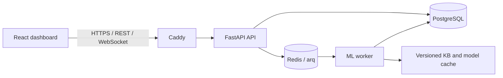

# MetaHarmonizer

[](https://github.com/AhmedOsamaAli/metaHarmonizer/actions/workflows/ci.yml)
[](https://github.com/AhmedOsamaAli/metaHarmonizer/actions/workflows/security.yml)
[](https://github.com/AhmedOsamaAli/metaHarmonizer/actions/workflows/deploy-smoke.yml)
[](LICENSE)

MetaHarmonizer is a human-in-the-loop platform for converting heterogeneous
clinical metadata into standardized, ontology-annotated, export-ready schemas.
It combines deterministic matching, curated aliases, semantic models, and an
optional LLM fallback with review workflows that keep curators in control.

**Public beta:** [metaharmonizer.online](https://metaharmonizer.online)

**Project:** [cBioPortal GSoC 2026 proposal](https://github.com/cBioPortal/GSoC/issues/136)

## Capabilities

- Map source columns to cBioPortal, GDC, and curated target schemas.
- Normalize values against NCIt, UBERON, and EFO ontology snapshots.
- Review low-confidence mappings in risk-prioritized schema and ontology queues.
- Reuse personal curator decisions and promote reviewed decisions to a shared layer.
- Compare quality, confidence, stage, and coverage metrics before export.
- Export validated cBioPortal-compatible clinical metadata.
- Run asynchronous jobs with bounded retries, queue backpressure, and live progress.
- Preserve reproducibility through schema versions, ontology snapshot hashes, and audit history.

## Architecture


```mermaid
flowchart LR
    Browser[React dashboard] -->|HTTPS / REST / WebSocket| Caddy
    Caddy --> API[FastAPI API]
    API --> PostgreSQL[(PostgreSQL)]
    API --> Redis[(Redis / arq)]
    Redis --> Worker[ML worker]
    Worker --> PostgreSQL
    Worker --> KB[Versioned KB and model cache]
```

The application accesses the upstream
[MetaHarmonizer engine](https://github.com/shbrief/MetaHarmonizer) exclusively
through `backend/app/engine_adapter/`. API, worker, and tests depend on the stable
adapter protocol rather than upstream implementation details.

## Technology

| Layer | Components |
|---|---|
| Frontend | React 18, TypeScript, Vite, Tailwind CSS, TanStack Query |
| API | FastAPI, Pydantic, SQLAlchemy async, Alembic |
| Data | PostgreSQL 16, Redis 7, arq |
| ML | MetaHarmonizer, Sentence Transformers, FAISS, optional Gemini |
| Operations | Docker Compose, Caddy, GitHub Actions, systemd adapters |

## Quick Start

Prerequisites: Docker Engine with Compose, approximately 15 GB free disk, and
8 GB RAM.

```bash
git clone https://github.com/AhmedOsamaAli/metaHarmonizer.git
cd metaHarmonizer
cp .env.example .env
```

For a local evaluation, set `AUTH_MODE=none` in `.env`. For JWT authentication,
replace `JWT_SECRET` with a random value of at least 32 bytes.

```bash
docker compose --profile kb run --rm kb-import
docker compose up --build
```

Open [http://localhost:8080](http://localhost:8080). The API health endpoint is
[http://localhost:8000/healthz](http://localhost:8000/healthz), and local Swagger
documentation is available at [http://localhost:8000/docs](http://localhost:8000/docs).

The API container applies Alembic migrations during startup. See the
[local setup guide](SETUP.md) for authenticated development, native hot reload,
email configuration, reset procedures, and troubleshooting.

## Development and Testing

```bash
# Backend
cd backend
pytest

# Frontend
cd frontend
npm install
npm run build
npm test

# End-to-end tests against a running stack
cd e2e
npm ci
npm test
```

Protected CI validates backend and frontend tests, coverage floors, dependency
audits, secret scanning, CodeQL, container vulnerability scans, SBOM generation,
non-root execution, and runtime smoke tests. The
[engine adapter contract](.github/workflows/engine-boundary.yml) prevents direct
upstream-engine imports outside the adapter boundary.

## Documentation

- [Local setup and troubleshooting](SETUP.md)
- [Production deployment and recovery](DEPLOY.md)
- [Curator guide](docs/curator-guide.md)
- [Production operations](docs/production-operations.md)
- [Service-level objectives](docs/service-level-objectives.md)
- [Capacity and scaling](docs/scaling-plan.md)
- [Load and stress testing](load/README.md)
- [Engine adapter](backend/app/engine_adapter/README.md)
- [MCP server](mcp/README.md)

## Security and Data Handling

MetaHarmonizer is intended for de-identified metadata. Do not upload protected
health information, direct identifiers, secrets, or credentials. Production
deployments should use HTTPS, strong host-only secrets, restricted registration,
encrypted off-host backups, and named operators. Security reports that may
contain sensitive information should not be posted to public issues.

Operational defaults and deployment controls are documented in
[DEPLOY.md](DEPLOY.md) and [production operations](docs/production-operations.md).

## Contributing

1. Create a focused branch from `main`.
2. Add tests for behavioral changes.
3. Run the relevant backend, frontend, or end-to-end suite.
4. Open a pull request and wait for all protected checks.

Major dependency, engine, schema, and infrastructure changes require explicit
migration notes and targeted validation.

## License and Acknowledgments

This project is distributed under the [repository license](LICENSE).

- [MetaHarmonizer](https://github.com/shbrief/MetaHarmonizer)
- [cBioPortal](https://www.cbioportal.org/)
- [NCI Thesaurus](https://ncithesaurus.nci.nih.gov/)
- [EBI Ontology Lookup Service](https://www.ebi.ac.uk/ols4/)
