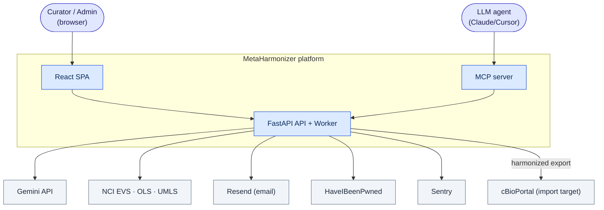
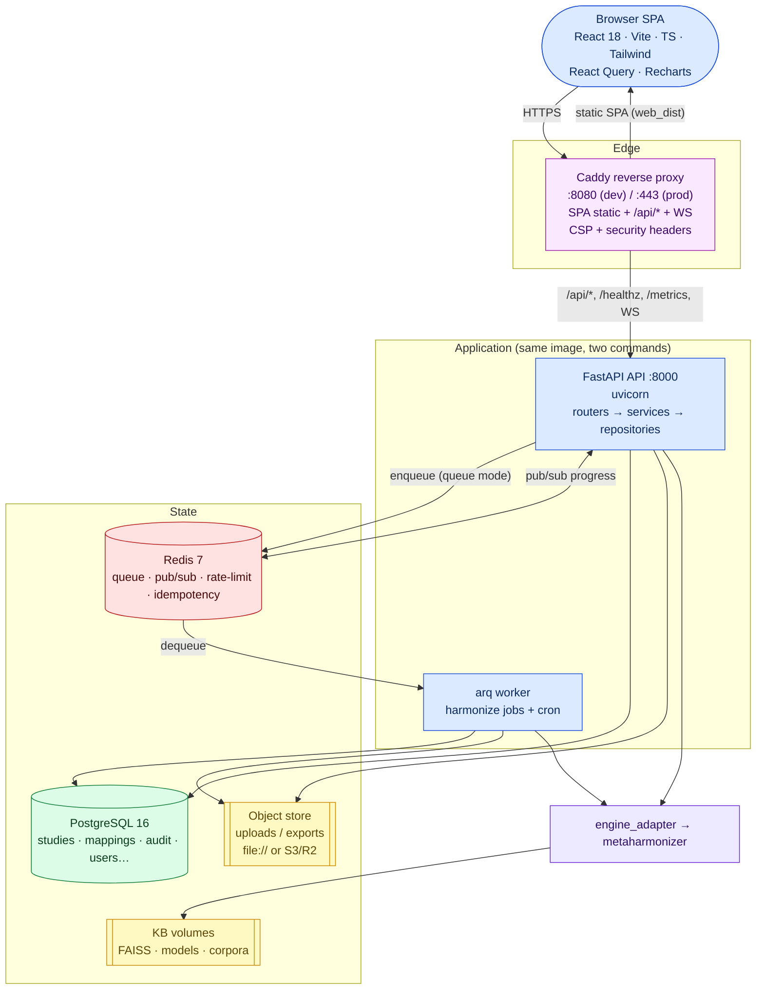
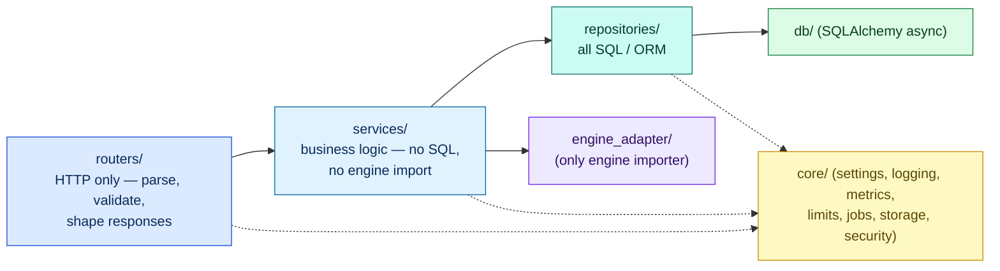
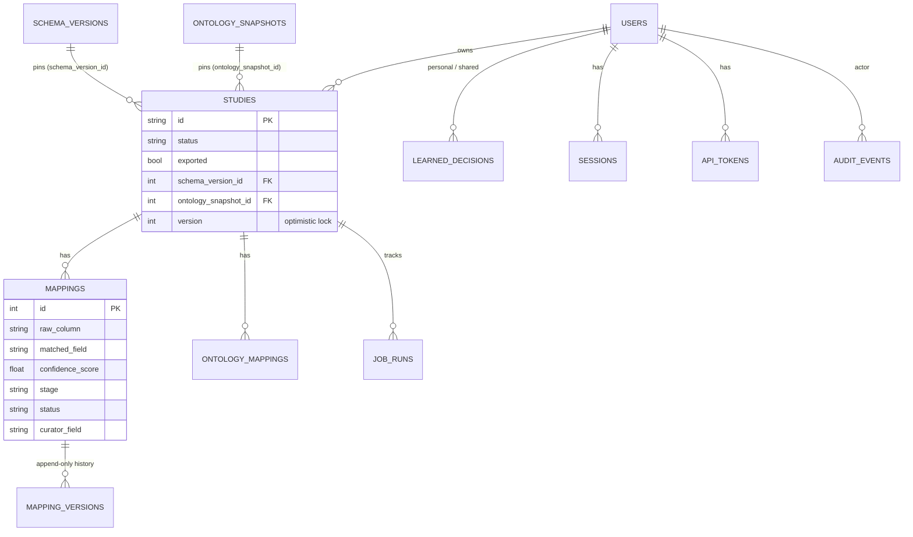
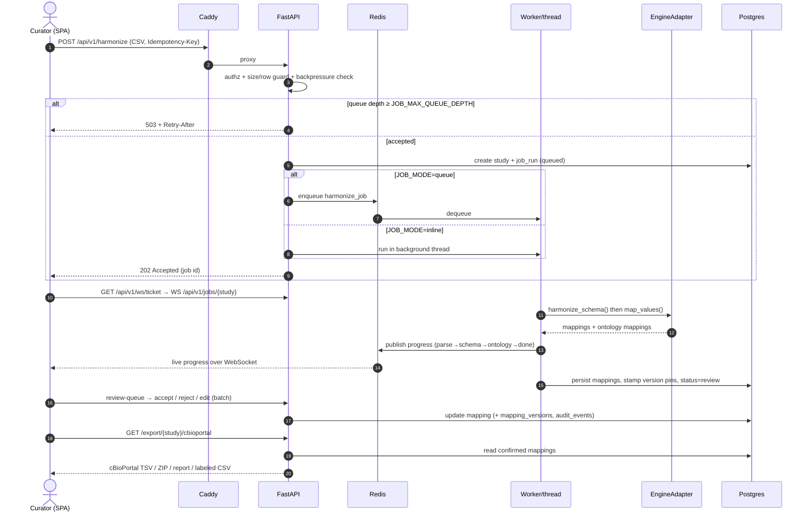
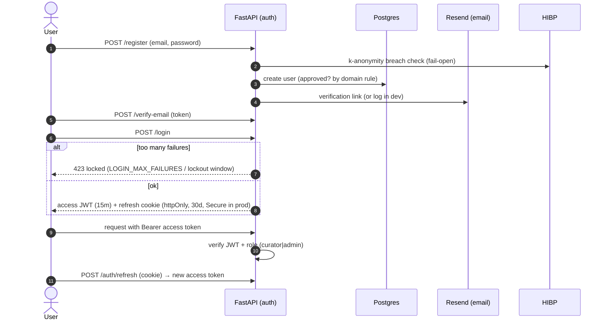
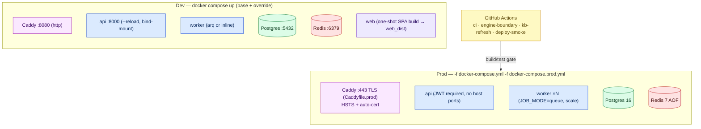

# MetaHarmonizer — Dashboard Services System Design (High-Level)

> Presentation-ready architecture of the **curator dashboard platform**: the SPA,
> the reverse proxy, the FastAPI service layers, the job pipeline, the datastores,
> and the cross-cutting concerns. Claims are grounded in source with inline references.

---

## 1. System context

MetaHarmonizer Dashboard is a **curator-in-the-loop** web application: a curator uploads a study's
metadata table, the engine proposes column→field and value→ontology mappings with confidence, and the
curator reviews/edits before exporting **cBioPortal-compatible** outputs. Every decision is audited
and every study is pinned to a schema version + ontology snapshot for reproducibility.

---

## 2. Container view (runtime processes)

Evidence: [docker-compose.yml](../../docker-compose.yml) (same `./backend` image for `api` and
`worker`, differing only by `command`), [Caddyfile](../../Caddyfile) routing,
[main.py](../../backend/app/main.py) router mounting.

---

## 3. The layered backend (enforced boundaries)

The backend follows a strict, **CI-enforced** dependency direction
([backend/STRUCTURE.md](../../backend/STRUCTURE.md)):

**Rules (from STRUCTURE.md):** routers do no SQL and no engine calls; services hold business logic
with no raw SQL and no `metaharmonizer` import; repositories own all SQL; only services/workers call
the engine adapter; `core/` is depended on by everyone and depends on nothing app-specific.

### 3.1 API surface (v1)

Mounted in [main.py](../../backend/app/main.py); prefixes from each router file:

| Router | Prefix | Purpose |
|---|---|---|
| `auth` | `/api/v1/auth` | register, login, verify-email, forgot/reset-password, refresh, logout |
| `admin` | `/api/v1/admin` | users, roles, approvals, force-logout, **schema-versions**, aliases, learned-decision promotion |
| `tokens` | `/api/v1/tokens` | personal API tokens |
| `harmonize` | `/api/v1` | **POST /harmonize** (202), job status, target-schemas, schema-versions |
| `mappings` | `/api/v1/mappings` | list, **review-queue** (active-learning order), accept/reject/edit, batch |
| `ontology` | `/api/v1/ontology` | value-mapping review, term **search**, snapshots |
| `quality` | `/api/v1/quality` | per-study coverage / confidence / stage metrics |
| `export` | `/api/v1/export` | harmonized CSV, cBioPortal TSV, study ZIP, report JSON, labeled dataset |
| `federation` | `/api/v1/federation` | public-key, signed export, verified import (Ed25519) |
| `audit` | `/api/v1/audit` | append-only activity log query |
| `ws` | `/api/v1` | WS **ticket** + `/jobs/{study_id}` live progress |
| `health` | `/` | `/healthz`, `/readyz`, `/health/engine` |

### 3.2 Cross-cutting middleware (order from `main.py`)

`install_observability` (request-id + unified error envelope) → `SecurityHeadersMiddleware` →
`MetricsMiddleware` (Prometheus golden signals at admin-scoped `/metrics`) → `install_limits`
(sliding-window rate limit + idempotency, **fail-open** if Redis down) → CORS (explicit origins,
methods, headers; `Idempotency-Key` allowed).

---

## 4. Domain services & data model

**Services** ([backend/app/services/](../../backend/app/services)):
`harmonizer` (orchestration + dictionary ontology fallback), `exporter` (cBioPortal / harmonized /
report / labeled formats), `analytics` (quality metrics), `active_learning` (risky-first,
group-look-alikes review queue), `learned_apply` (reuse remembered decisions), `linkml_gate`
(schema validation), `mapping_evaluation`, `schema_diff`, `federation`.

**Core data model** ([backend/app/db/models.py](../../backend/app/db/models.py)):

Key traits: **append-only audit** (`audit_events`) + **mapping version history** (`mapping_versions`);
**optimistic concurrency** (`OptimisticVersionMixin` → 409 on stale writes); **two-axis reproducibility
pin** (`schema_version_id` + `ontology_snapshot_id`); **two-layer curation KB**
(`learned_decisions`: personal vs admin-promoted shared — ADR-0002).

---

## 5. Workflow — request lifecycle (upload → review → export)

**Resilience:** idempotency keys de-dupe retried uploads; backpressure returns `503 + Retry-After`
past `JOB_MAX_QUEUE_DEPTH`; rate limiting and idempotency **fail open** if Redis is unavailable;
engine work runs off the event loop; live progress is process-agnostic (any connected client sees it
via the Redis bus). Evidence: [core/settings.py](../../backend/app/core/settings.py),
[workers/tasks.py](../../backend/app/workers/tasks.py), [core/limits.py](../../backend/app/core/limits.py).

---

## 6. Workflow — authentication & authorization

Modes: `AUTH_MODE=jwt` (default; JWT secret strength enforced at boot) or `AUTH_MODE=none`
(dev bypass returning a real dev-admin row). Admin approval gates untrusted-domain signups; WS auth
uses a one-time 30 s ticket. Evidence: [routers/auth.py](../../backend/app/routers/auth.py),
[core/settings.py](../../backend/app/core/settings.py).

---

## 7. Deployment topology

- **Networking:** only Caddy is public in prod; API/worker/DB/Redis are on the internal compose
  network. Uploads volume is shared api↔worker so queue mode reads the same file.
- **Secrets:** `.env` (git-ignored); prod requires a real `JWT_SECRET` (boot fails otherwise);
  `docker-compose.prod.yml` skips the dev override.
- **CI/CD:** [ci.yml](../../.github/workflows/ci.yml) (backend on PG+Redis with mock engine +
  frontend build), [engine-boundary.yml](../../.github/workflows/engine-boundary.yml),
  [kb-refresh.yml](../../.github/workflows/kb-refresh.yml),
  [deploy-smoke.yml](../../.github/workflows/deploy-smoke.yml); E2E via Playwright ([e2e/](../../e2e)).

---

## 8. Non-functional posture (for the review)

| Concern | How it's handled | Confidence |
|---|---|---|
| Scalability | Stateless API + horizontally-scaled arq workers (`--scale worker=N`); Redis-decoupled jobs. | High |
| Availability | Healthchecks + `depends_on: service_healthy`; fail-open limits; ontology dictionary fallback. | High |
| Consistency | Optimistic version locking (409); append-only audit + mapping versions. | High |
| Security | JWT + refresh cookie, RBAC, lockout, HIBP, CSP/security headers, rate-limit, upload guards. | High |
| Observability | Prometheus `/metrics`, structured logs + request-id, Sentry, `/healthz` `/readyz` `/health/engine`. | High |
| Reproducibility | Per-study schema-version + ontology-snapshot pins. | High |

---

*Companion documents:* [engine-system-design.md](engine-system-design.md) ·
[README.md](README.md) (full discovery, model, review, ADRs, exec summary) ·
C4 [workspace.dsl](workspace.dsl) · [architecture.d2](architecture.d2) · [architecture.drawio](architecture.drawio)
