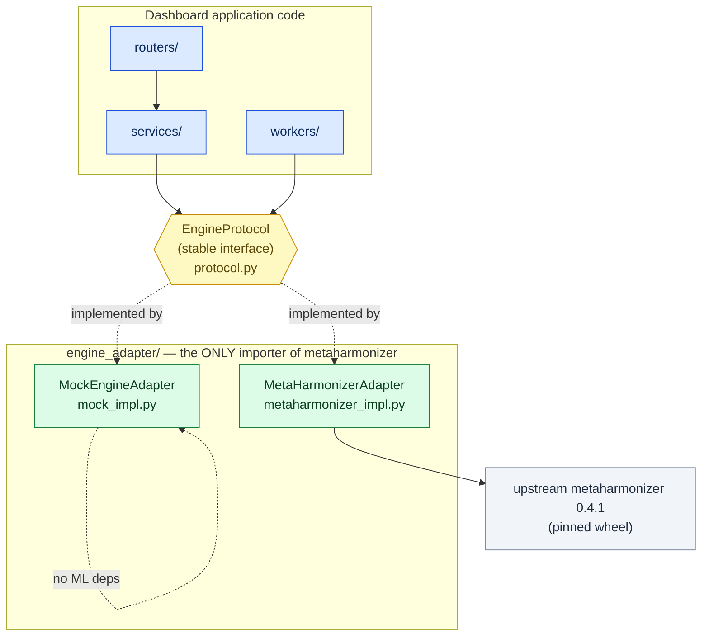
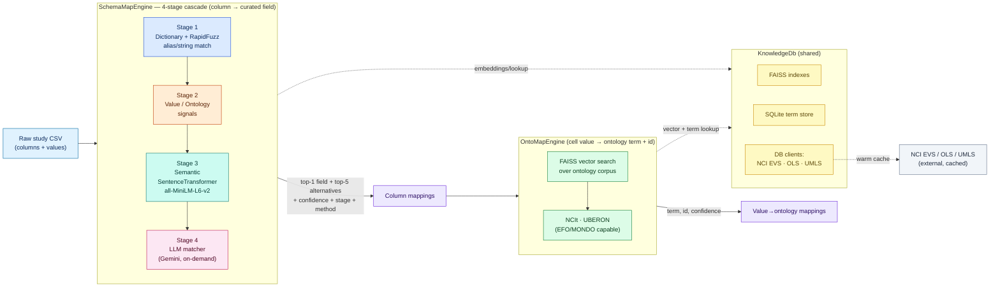
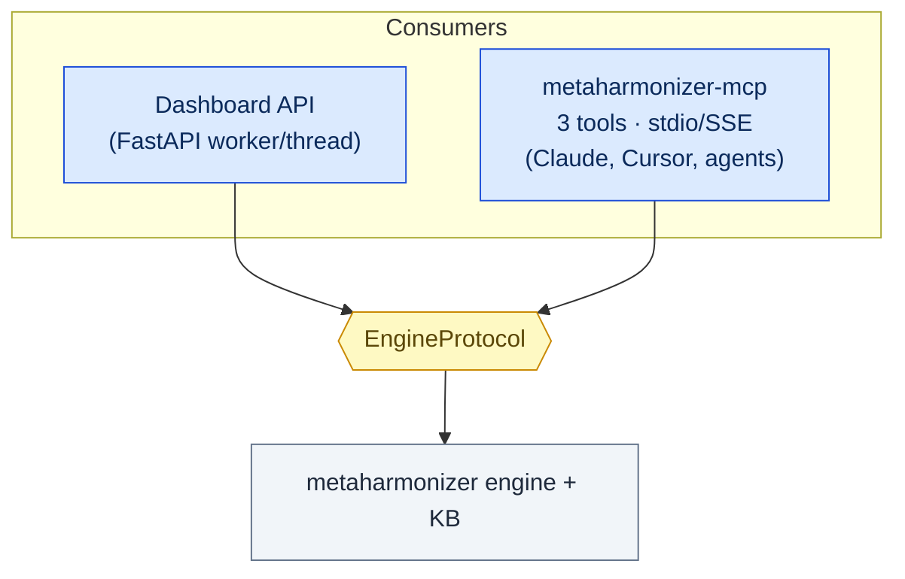
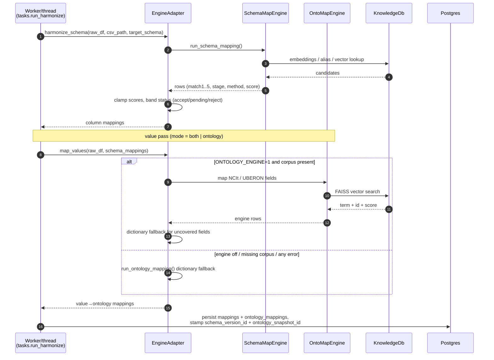

# MetaHarmonizer — Engine System Design (High-Level)

> Presentation-ready architecture of the **harmonization engine** and the
> boundary the dashboard uses to consume it. Every claim below is grounded in
> source; file references are given inline.

---

## 1. What the engine is

The engine is the upstream ML package **`metaharmonizer`** (v0.4.1, `shbrief/MetaHarmonizer`),
consumed by the dashboard as a **pinned wheel** ([backend/vendor/](../../backend/vendor)) behind a
stable Python contract. It answers three questions about a clinical-metadata table:

| Capability | Question answered | Contract method |
|---|---|---|
| **Schema mapping** | Which curated field does this *column* mean? (`gender` → `SEX`) | `harmonize_schema()` |
| **Value → ontology mapping** | Which canonical term + ID does this *cell value* mean? (`stool` → `UBERON:0001988`) | `map_values()` |
| **On-demand LLM match** | Best guess for one hard column, with reasoning | `llm_match()` |

Source of truth for the contract: [backend/app/engine_adapter/protocol.py](../../backend/app/engine_adapter/protocol.py).

---

## 2. Core design principle — depend on a contract, not a file tree

The single most important architectural decision (ADR-0001) is that **exactly one file** in the
whole codebase is allowed to `import metaharmonizer`:
[backend/app/engine_adapter/metaharmonizer_impl.py](../../backend/app/engine_adapter/metaharmonizer_impl.py).
Everything else depends on `EngineProtocol`. This is enforced in CI by
[scripts/check_engine_boundary.py](../../scripts/check_engine_boundary.py) via
[.github/workflows/engine-boundary.yml](../../.github/workflows/engine-boundary.yml).

**Why it matters:** an upstream engine upgrade becomes a one-line dependency bump plus adapter
tweaks, not a 200-file rewrite. `ENGINE_IMPL=mock|metaharmonizer`
([settings.py](../../backend/app/core/settings.py)) swaps the whole ML stack — the mock lets CI,
unit tests, and demos run with no torch/FAISS/network.

---

## 3. The engine internals (what happens inside `metaharmonizer`)

Two engines run in sequence, backed by a shared Knowledge DB.

**Evidence:**
- The 4 stages, `all-MiniLM-L6-v2`, and the on-demand LLM matcher are referenced across
  [metaharmonizer_impl.py](../../backend/app/engine_adapter/metaharmonizer_impl.py) (`SchemaMapEngine`,
  `LLMMatcher`, `loaded_models=["all-MiniLM-L6-v2"]`) and the stage labels appear in the UI
  ([StageBadge.tsx](../../frontend/src/components/StageBadge.tsx): *S1 Dict/Fuzzy, S2 Value/Ontology,
  S3 Semantic, S4 LLM*).
- `OntoMapEngine`, FAISS, SQLite, and NCI/OLS/UMLS clients are described in the
  [engine adapter guide](../../backend/app/engine_adapter/README.md) and
  [ADR 0001](../adr/0001-engine-adapter-pattern.md), and wired in
  [engine_adapter/_ontology.py](../../backend/app/engine_adapter/_ontology.py).
- The KB bundle is the ~1.4 GB FAISS + models + corpora set, seeded offline (see Section 6).

### 3.1 Confidence → status banding

The adapter converts each engine row into the dashboard shape and assigns a status
([`_to_dashboard_row`](../../backend/app/engine_adapter/metaharmonizer_impl.py)):

- `stage == "invalid"` → **rejected**
- `confidence ≥ AUTO_ACCEPT_THRESHOLD` (default **0.9**) → **accepted** (auto)
- otherwise → **pending** (flagged for human review)

Scores are clamped to `[0,1]`; the top match plus up to 4 alternatives are returned.

---

## 4. The adapter package (translation + performance)

[backend/app/engine_adapter/](../../backend/app/engine_adapter/) is more than a thin wrapper:

| File | Responsibility |
|---|---|
| `protocol.py` | `EngineProtocol` — the contract (schema/values/LLM/pre_warm/health). |
| `metaharmonizer_impl.py` | Real adapter. Only importer of the wheel. Translates upstream `match1..5`/`stage`/`method` → dashboard rows; resolves target schema; merges admin alias uploads. |
| `mock_impl.py` | Deterministic, dependency-free engine for tests/CI/demo. |
| `_schema_registry.py` | Resolves the curator-selected target schema (GDC / cBioPortal / cMD presets or admin-uploaded versions). |
| `_ontology.py` | Routes NCIt-disease / UBERON-bodysite / NCIt-treatment through `OntoMapEngine`; dictionary fallback for the rest. |
| `_perf.py` | Shared-model + persistent NCI-EVS cache patches; `warm_model()`, `save_nci_cache()`. |
| `schema_dicts.py`, `types.py` | Curated dictionaries; typed DTOs (`EngineHealth`). |

**Performance model (evidence in `_perf.py` + `pre_warm()`):** the ~90 MB SentenceTransformer and
dictionaries load **once** at process start; the NCI EVS cache is warmed by harmonizing a sample CSV
so the first real upload skips ~90 s of cold API calls. A shared-model patch means every study after
the first reuses the loaded model.

---

## 5. Two consumers, one boundary

The exact same engine boundary serves both the dashboard **and** an MCP server for LLM agents —
neither knows which `ENGINE_IMPL` is active.

MCP tools: `harmonize_table`, `harmonize_columns`, `harmonize_values`
([mcp/src/metaharmonizer_mcp/server.py](../../mcp/src/metaharmonizer_mcp/server.py)); the MCP package
bridges to the same adapter via its own `engine.py`, preserving the boundary
(verified in [mcp/tests](../../mcp/tests)).

---

## 6. Knowledge Base (KB) lifecycle — reproducibility

The engine's "knowledge" (FAISS indexes, embedding model, ontology corpora) is a **large, versioned
bundle** delivered out-of-band, never at request time.

```mermaid
flowchart LR
    BUILD["scripts/build_kb.py<br/>+ package_kb"]:::job -->|"kb_offline_bundle.tar.gz"| BUNDLE["KB bundle (~1.4 GB)<br/>FAISS + models + corpora"]:::store
    BUNDLE -->|"one-shot: kb-import<br/>(compose --profile kb)"| VOLS["Docker volumes:<br/>engine_cache · corpus_data · hf_cache"]:::store
    VOLS --> API["api / worker<br/>HF_HUB_OFFLINE=1<br/>TRANSFORMERS_OFFLINE=1"]:::app
    API -->|"stamps"| PIN["ontology_snapshots<br/>(engine_version + bundle sha)"]:::db

    classDef job fill:#ede9fe,stroke:#6d28d9,color:#2e1065
    classDef store fill:#fef9c3,stroke:#ca8a04,color:#5b4708
    classDef app fill:#dbeafe,stroke:#1d4ed8,color:#0b2a5b
    classDef db fill:#dcfce7,stroke:#15803d,color:#0b3d1e
```

- Seeded once via the `kb` compose profile ([docker-compose.yml](../../docker-compose.yml) `kb-import`);
  models load **offline** (`HF_HUB_OFFLINE=1`, `TRANSFORMERS_OFFLINE=1`).
- Every study is stamped with the **current ontology snapshot** (engine version + bundle sha256) on
  startup seeding ([main.py](../../backend/app/main.py) lifespan → `onto_repo.ensure_current`), giving
  a per-study reproducibility pin. Refreshed by [.github/workflows/kb-refresh.yml](../../.github/workflows/kb-refresh.yml).
- Full narrative: [docs/kb-lifecycle.md](../kb-lifecycle.md).

---

## 7. Workflow — a harmonization run (control + data + failure paths)

**Failure & resilience (evidence in
[tasks.py](../../backend/app/workers/tasks.py) + [metaharmonizer_impl.py](../../backend/app/engine_adapter/metaharmonizer_impl.py)):**
- The ontology pass is wrapped so **any** engine error falls back to the curated dictionary — a KB
  problem degrades quality, it never fails the job.
- CPU-heavy engine work runs in a **worker thread** (`anyio`) so the API event loop stays responsive.
- In queue mode, arq enforces **3 retries with backoff** and a **hard timeout** (job killed) —
  [arq_worker.py](../../backend/app/workers/arq_worker.py).
- Stage-by-stage progress is published on a Redis bus for live UI updates; a cancel flag is checked at
  each stage boundary.

---

## 8. Engine-side risks & notes (for the review)

| Area | Observation | Confidence |
|---|---|---|
| Cold start | First process pays model-load + NCI warm (~90 s) unless pre-warmed; `pre_warm()` mitigates. | High — code-evidenced |
| KB size | ~1.4 GB bundle must be seeded per environment; not pulled at runtime (offline flags). | High |
| LLM dependency | Stage 4 needs `GEMINI_API_KEY`; absent ⇒ engine runs in `manual` mode, no LLM stage. | High |
| External vocab APIs | NCI EVS/OLS/UMLS are cached; first-run latency + external availability are the coupling points. | Medium — cache persists, TTL not audited here |
| Single wheel pin | Correctness depends on the vendored wheel matching the tested engine (see repo memory on wheel drift). | High |

---

*Companion documents:* [dashboard-system-design.md](dashboard-system-design.md) ·
[README.md](README.md) (full discovery, review, ADRs) · C4 [workspace.dsl](workspace.dsl) ·
[architecture.d2](architecture.d2) · [architecture.drawio](architecture.drawio)
