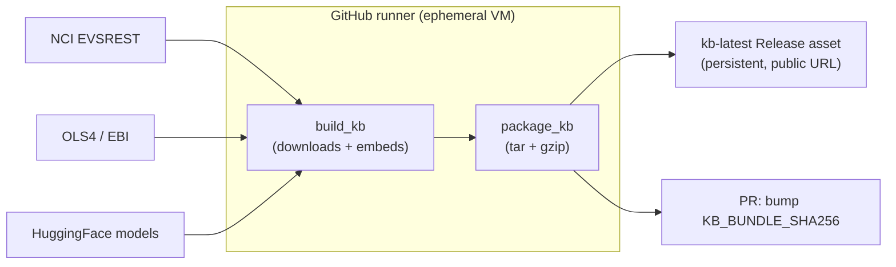

# KB lifecycle: build → publish → consume → refresh

The engine's knowledge base (FAISS + SQLite indexes over NCIt / UBERON / EFO)
and the embedding models are large and built **out-of-band**, then shipped as
one offline bundle (`kb_offline_bundle.tar.gz`). Running instances **seed** that
bundle — they never build it.

## Refresh pipeline (`.github/workflows/kb-refresh.yml`)

Runs on an **ephemeral GitHub runner** (manual `workflow_dispatch` or a quarterly
cron). Nothing runs on your laptop or the prod server — the runner fetches,
builds, compresses, uploads, then is destroyed.



- **Downloads / requests** happen on the runner during `build_kb`: NCIt via
  EVSREST, UBERON via OLS4, models from HuggingFace (+ optional
  `UMLS_API_KEY` secret for synonym enrichment — base corpora fetch key-free).
- **Tar / compress** via `package_kb` → `kb/kb_offline_bundle.tar.gz`.
- **Upload** to the `kb-latest` GitHub Release (`gh release upload --clobber`),
  then a PR bumps `KB_BUNDLE_SHA256` so the download integrity check stays valid.
- **Report** in the GitHub Actions summary: per-corpus rows, added/removed IDs,
  relabeled IDs, and before/after mapping-quality metrics. The same evidence,
  including affected ID lists, is retained for 90 days as JSON/CSV artifacts.

## Consume (every instance, local or prod)

```
docker compose --profile kb run --rm kb-import   # download from KB_BUNDLE_URL + verify sha256 + seed volumes
docker compose up --build                        # api/worker load the KB + models offline (HF_HUB_OFFLINE=1)
```

The bundle is a **point-in-time snapshot**; studies are stamped with the
schema/ontology version they were harmonized against (`SchemaVersion` /
`OntologySnapshot`) so results stay reproducible even after a later refresh.
Learned decisions live in PostgreSQL and are not replaced by a bundle refresh.
The impact report identifies removed or relabeled ontology IDs that may require
an administrator to review corresponding learned targets.
